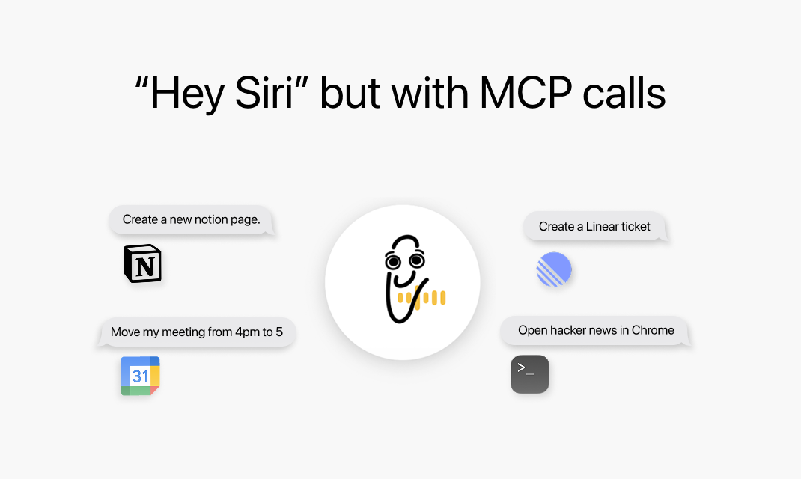
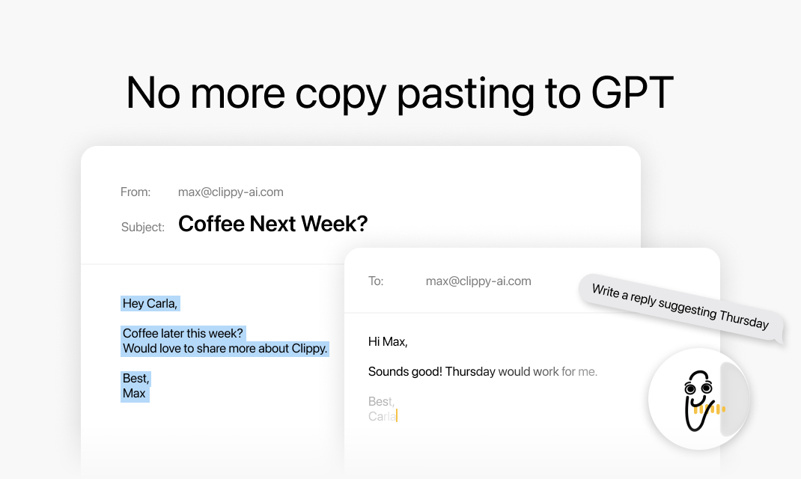
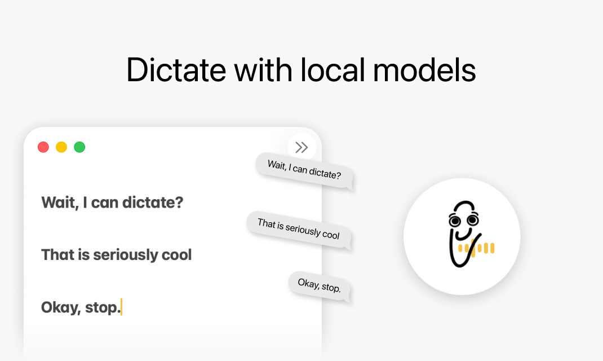
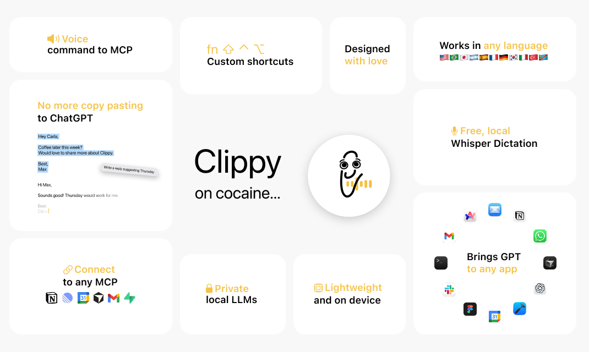

# Homie

A voice-controlled AI assistant for macOS with local speech processing and cloud AI integration.

## Features


*Voice commands trigger MCP integrations with Notion, Linear, Google Calendar, and more.*


*Draft email replies instantly without copy-pasting to ChatGPT.*


*Real-time speech-to-text dictation powered by local Whisper models.*


*Feature overview: voice commands, MCP connections, local LLMs, multi-language support, and app integrations.*

## Prerequisites

- macOS 13+ (15+ for running the app)
- Xcode (latest stable)
- Node.js 18+
- Supabase CLI
- Apple Developer account (for code signing)

## Quick Start

### 1. Clone the repository

```bash
git clone https://github.com/your-org/homie.git
cd homie
```

### 2. macOS App

```bash
cd homie
cp Local.xcconfig.example Local.xcconfig
# Edit Local.xcconfig with your credentials
open homie.xcodeproj
# Build and run (Cmd+R)
```

### 3. Website

```bash
cd homie_website
npm install
npm run dev
```

### 4. Supabase Backend

```bash
supabase login
supabase link --project-ref YOUR_PROJECT_REF
supabase functions deploy
```

## Configuration

Copy `.env.example` to `.env` and configure:

- **Supabase** - Backend URL and keys

See [.env.example](.env.example) for all required variables.

## Project Structure

```
homie_project/
├── homie/           # macOS app (Swift/SwiftUI)
├── homie_website/   # Web app (Next.js 15)
└── supabase/        # Edge Functions + migrations
```

## Contributing

See [CONTRIBUTING.md](CONTRIBUTING.md) for guidelines.

## License

[MIT](LICENSE)
